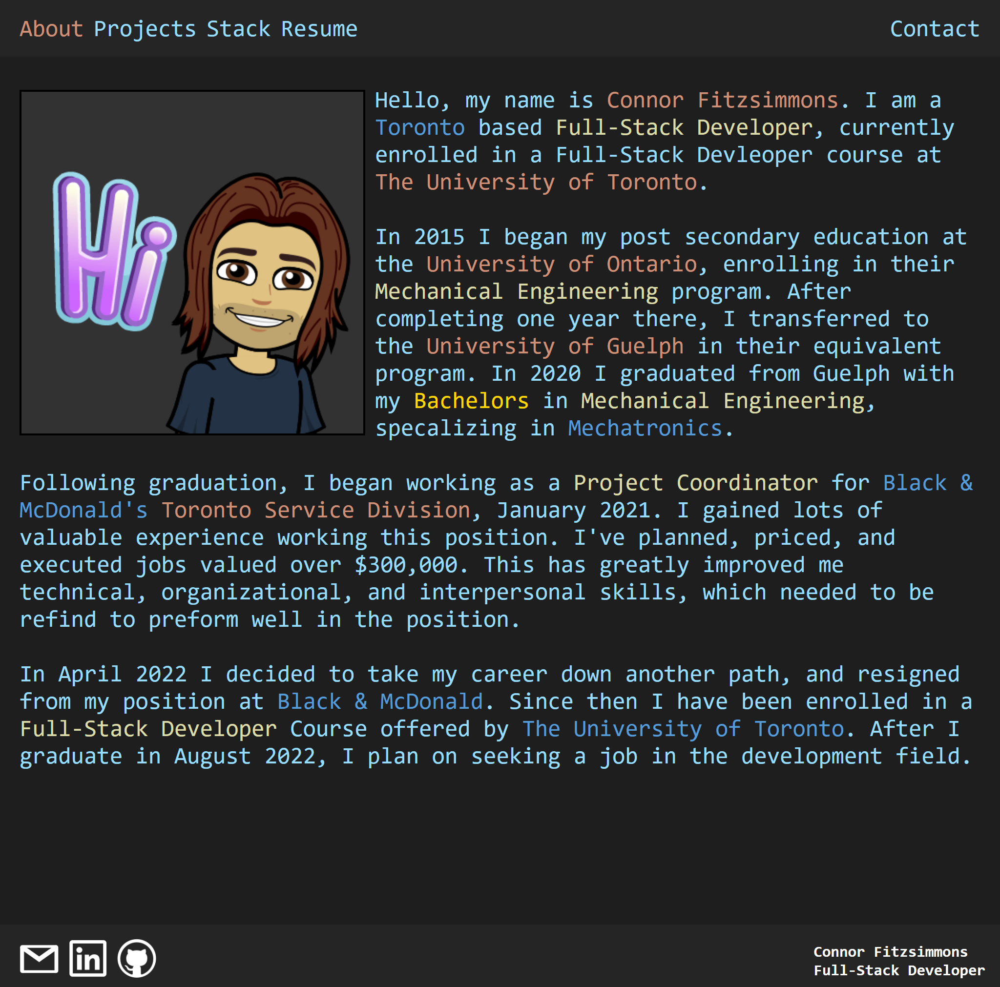
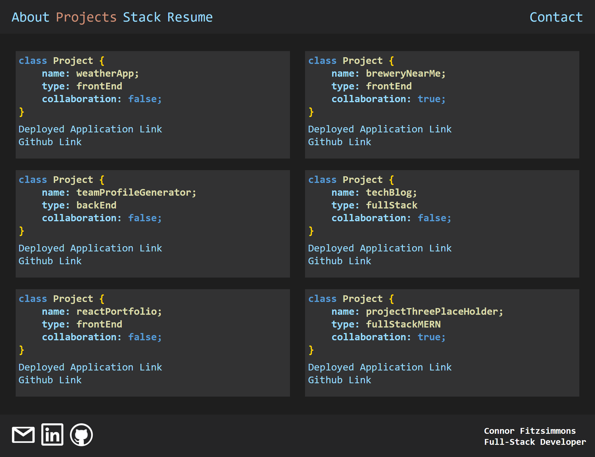
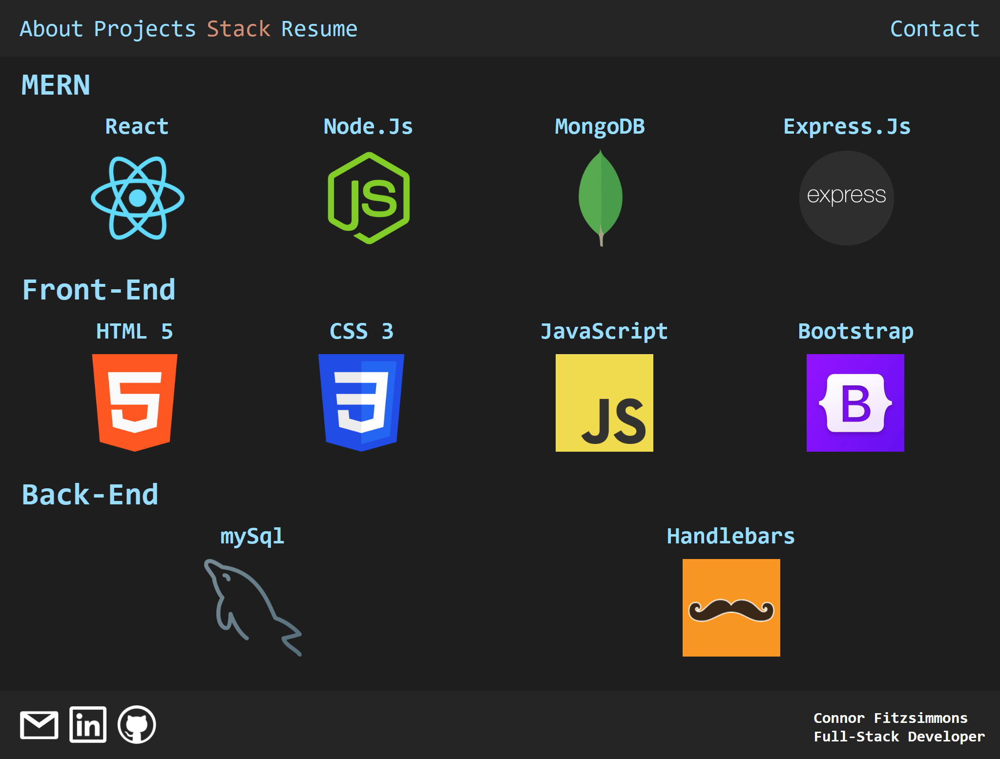
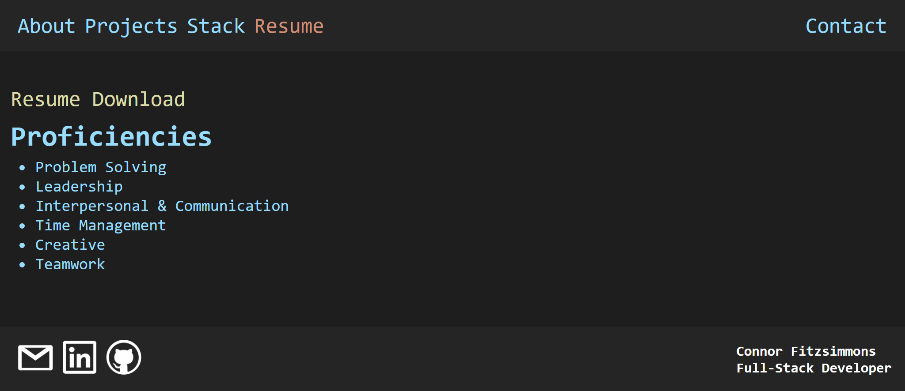
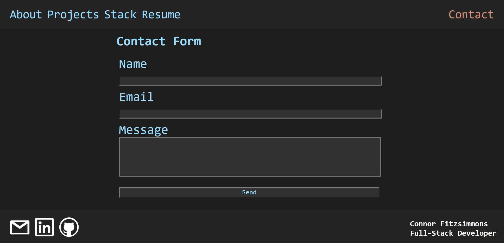

# Reat: Portfolio

## Link

https://connor-kfitz.github.io/purple-frog/#about

## Description
The purpose of this project is to design a personal protfolio web-page.  The page will be built using React and feature other npm packages such as emailJs and framerMotion.  A mobile-first design apporach will be used during creation.

Initially loading the page will bring the user to an "about" page, where information on the creater can be found.  Additonal nav links at the top can redirect the user to a "projects", "stack", "resume", and "contact" pages.  The "projects" page will feature six of the creaters best projects laid on responsive tiles, with reference links.  The "stack" and "resume" sections will display the creaters technical and soft skills respectively.  The "resume" page will also contain a download link for the creaters resume.  Lastly the "contact" page will have have form fields that allow the user to contact the creater via email messaging.    

## Steps Taken

1.  Created a react application and implemented desired folder structure in the src

2.  Created required index.js, app.js, component, and js files

3.  Coded base and functionallity of nav, footer, portfolio container, and pages

4.  Added utils/helpers.js, coded base and functionallity for contact page.  Installed and configured mailJS to allow users to send email messages

5.  Styled all components and pages

6.  Installed and configured framerMotion to work on the stack page's logos

## Pictures

### About Page

### Projects Page

### Stack Page

### Resume Page

### Contact Page

